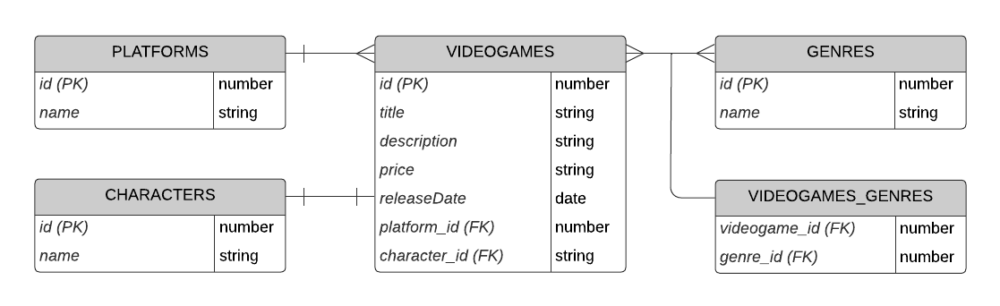

# M3-05 TypeORM I

[Volver a Inicio](../README.md)

## Links

- [TypeORM - Documentación](https://typeorm.io/)

## Demo de TypeORM

- En carpeta [05-typeorm](../../05-typeorm/) está la demo completa
  - Configuración
  - Todos los tipo de relaciones en TypeORM
  - CRUD de cada entidad
  - Para utilizarla, deben crear el archivo ".env" con sus credenciales de PostgreSQL utilizando los siguientes nombres:

```.env
PORT=3000
DB_HOST=localhost
DB_PORT=5432
DB_USERNAME=postgres
DB_PASSWORD=mypassword
DB_NAME=nombre_de_la_base_de_datos
```

### Readme con las instrucciones

- En el [README](../../05-typeorm/README.md) hay ejemplos en "JSON" para probar todas las rutas en Thunder Client, Postman o similar.

### Diagrama Entidad/Relación de la Demo


