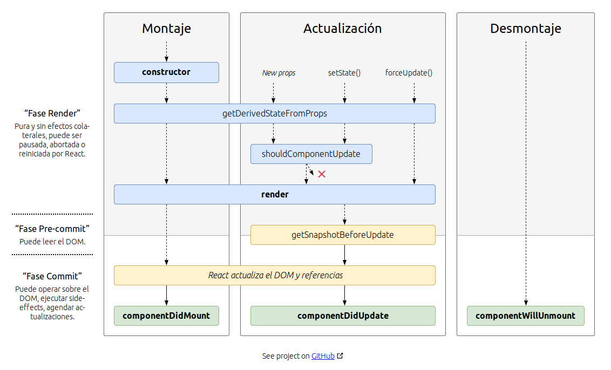

# M3-09 React LifeCycle

[Volver a Inicio](../README.md)

## Links

- [Harry Potter App: Todos los personajes](https://hp-api.onrender.com/api/characters)
- [Harry Potter App: Personaje por id](https://hp-api.onrender.com/api/character/9e3f7ce4-b9a7-4244-b709-dae5c1f1d4a8)
- [CORS Documentación](https://www.npmjs.com/package/cors)

## Ciclo de Vida de un Componente



## 🎯CORS (Cross-Origin Resource Sharing)

> CORS es una tecnología de seguridad que permite o restringe que recursos web en una página web sean solicitados desde un dominio distinto al que sirvió el recurso original. Este tipo de solicitud cross-origin puede ser bloqueado por el navegador debido a la política de seguridad del mismo origen (Same-Origin Policy), que es una medida de seguridad implementada para prevenir ataques como Cross-Site Scripting (XSS) y Cross-Site Request Forgery (CSRF).

### Instalación de CORS

- Librería CORS: En modo Producción

```bash
npm install cors
```

- Tipos de CORS para TypeScript: En modo Desarrollo

```bash
npm install --save-dev @types/cors
```

### Conceptos Clave de CORS

1. Same-Origin Policy: Regla de seguridad que restringe cómo un documento o script cargado desde un origen puede interactuar con un recurso de otro origen. Un origen está definido por el esquema (http, https), el host y el puerto.
2. Solicitudes Cross-Origin: Ocurren cuando un recurso solicita un recurso de un dominio diferente. Por ejemplo, un sitio web en http://example.com intenta hacer una solicitud AJAX a http://api.example.com.
3. Cabeceras HTTP Relacionadas con CORS:
   - Access-Control-Allow-Origin: Especifica qué dominios pueden acceder a los recursos.
   - Access-Control-Allow-Methods: Especifica los métodos HTTP permitidos (GET, POST, PUT, DELETE, etc.).
   - Access-Control-Allow-Headers: Especifica qué cabeceras pueden ser utilizadas en la solicitud.
   - Access-Control-Allow-Credentials: Indica si las solicitudes pueden incluir credenciales (cookies, encabezados HTTP de autenticación).
   - Access-Control-Expose-Headers: Indica qué encabezados pueden ser expuestos como parte de la respuesta.
4. Preflight Requests: Antes de hacer la solicitud principal, el navegador puede enviar una solicitud de preflight (OPTIONS) para verificar si el servidor permite la solicitud de origen cruzado. Esto es común con métodos HTTP que no sean GET o POST y cuando se utilizan ciertas cabeceras personalizadas.
5. Simple Requests: Las solicitudes que utilizan métodos HTTP básicos (GET, POST, HEAD) y no contienen cabeceras personalizadas específicas no requieren una solicitud de preflight.

Ejemplo de Configuración de CORS en un Servidor Express (Node.js):

```js
const express = require("express");
const cors = require("cors");
const app = express();

const corsOptions = {
  origin: "http://example.com",
  methods: "GET,HEAD,PUT,PATCH,POST,DELETE",
  credentials: true, // permitir cookies
  optionsSuccessStatus: 204,
};

app.use(cors(corsOptions));

app.get("/resource", (req, res) => {
  res.json({
    message: "Este recurso es accesible desde http://example.com",
  });
});

app.listen(3000, () => {
  console.log("Servidor corriendo en puerto 3000");
});
```

### Resumen

- CORS es una tecnología de seguridad que controla cómo los recursos web en una página pueden ser solicitados desde un dominio diferente. Utiliza cabeceras HTTP para permitir o restringir accesos y puede requerir una solicitud de preflight para solicitudes más complejas. Configurar CORS adecuadamente es esencial para la seguridad y funcionalidad de las aplicaciones web.
